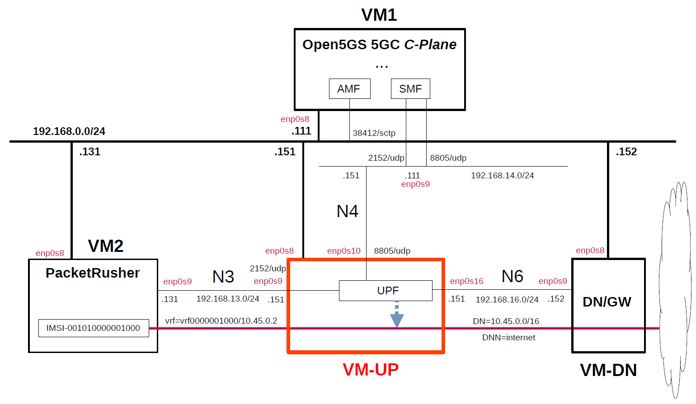

# Simple Measurement of UPF Performance
This describes simple performance measurements of several open source UPFs by using [PacketRusher](https://github.com/HewlettPackard/PacketRusher) as the performance measurement tool.
PacketRusher is also featured on [HPE Developer Blog](https://developer.hpe.com/blog/open-sourcing-packetrusher-a-5g-core-performance-tester/).

**Note. In this measurement, the performance of eUPF was measured using the binary that outputs kernel logs for debugging, and so the performance of eUPF is significantly lower.
Therefore, these measurement results are not useful. For the latest measurement results, please see [Performance Measurement](https://github.com/s5uishida/sample_config_misc_for_mobile_network#performance_measurement).**

**Performance measurement results are highly dependent on the measurement conditions. These results are only examples of results under certain measurement conditions.
And this is a very simple measurement, and according to [this comment](https://github.com/open5gs/open5gs/discussions/1780#discussioncomment-10853290), it doesn't seem to make much sense to measure between VMs. I hope it will serve as a reference for a simple configuration when measuring on real devices.**

---

### [Sample Configurations and Miscellaneous for Mobile Network](https://github.com/s5uishida/sample_config_misc_for_mobile_network)

---

<a id="toc"></a>

## Table of Contents

- [Simple Overview of UPF Performance Measurements](#overview)
- [Changes in configuration files of Open5GS, free5GC, UPFs and PacketRusher](#changes)
  - [Changes in configuration files of Open5GS 5GC C-Plane](#changes_cp_open5gs)
  - [Changes in configuration files of free5GC 5GC C-Plane](#changes_cp_free5gc)
  - [Changes in configuration files of UPFs](#changes_up)
    - [a-1. Changes in configuration files of Open5GS 5GC UPF (TUN)](#changes_up_a1)
    - [a-2. Changes in configuration files of Open5GS 5GC UPF (TAP)](#changes_up_a2)
    - [b. Changes in configuration files of UPG-VPP](#changes_up_b)
    - [c. Changes in configuration files of eUPF](#changes_up_c)
    - [d. Changes in configuration files of free5GC 5GC UPF](#changes_up_d)
  - [Changes in configuration files of PacketRusher](#changes_pr)
- [Network settings of UPFs and Data Network Gateway](#network_settings)
  - [a-1. Network settings of Open5GS 5GC UPF (TUN)](#network_settings_up_a1)
  - [a-2. Network settings of Open5GS 5GC UPF (TAP)](#network_settings_up_a2)
  - [b. Network settings of UPG-VPP](#network_settings_up_b)
  - [c. Network settings of eUPF](#network_settings_up_c)
  - [d. Network settings of free5GC 5GC UPF](#network_settings_up_d)
  - [Network settings of Data Network Gateway](#network_settings_dn)
- [Build Open5GS, free5GC, UPFs and PacketRusher](#build)
- [Run Open5GS, free5GC and UPFs](#run)
  - [Run UPFs](#run_up)
    - [a-1. Run Open5GS 5GC UPF (TUN)](#run_up_a1)
    - [a-2. Run Open5GS 5GC UPF (TAP)](#run_up_a2)
    - [b. Run UPG-VPP](#run_up_b)
    - [c. Run eUPF](#run_up_c)
    - [d. Run free5GC 5GC UPF](#run_up_d)
  - [Run 5GC C-Plane](#run_cp)
    - [Run Open5GS 5GC C-Plane](#run_cp_open5gs)
    - [Run free5GC 5GC C-Plane](#run_cp_free5gc)
- [Measure using PacketRusher](#measure)
  - [Run PacketRusher on VM2](#run_packet_rusher)
  - [Run iPerf3 server on Data Network Gateway (VM-DN)](#run_iperf3_server)
  - [Try ping and iPerf3 client on VM2](#try_ping_iperf3)
- [Results](#results)
- [Changelog (summary)](#changelog)

---

<a id="overview"></a>

## Simple Overview of UPF Performance Measurements

Using Open5GS for 5GC, I will easily measure the performance of several open source UPFs with PacketRusher.
**Note that this configuration is implemented with Virtualbox VMs.**

The following minimum configuration was set as a condition.
- Only one each for C-Plane, U-Plane(UPF) and RAN&UE(performance measurement tool).

The built simulation environment is as follows.

</img>

The 5GC / RAN&UE used are as follows.

- 5GC - Open5GS v2.7.0 (2023.12.04) - https://github.com/open5gs/open5gs  
  *for Open5GS UPF, UPG-VPP and eUPF*
- 5GC - free5GC v3.3.0 (2023.11.03) - https://github.com/free5gc/free5gc  
  *for free5GC UPF*
- RAN&UE - PacketRusher (2023.12.06) - https://github.com/HewlettPackard/PacketRusher

The UPFs used are as follows.

- Open5GS UPF v2.7.0 (2023.12.04) - https://github.com/open5gs/open5gs
- UPG-VPP v1.11.0 (2023.12.11) - https://github.com/travelping/upg-vpp
- eUPF v0.6.0 (2023.12.05) - https://github.com/edgecomllc/eupf
- free5GC UPF v1.2.0 (2023.11.12) - https://github.com/free5gc/go-upf

Each VMs are as follows.
| VM | SW & Role | IP address | OS | CPU | Memory | HDD |
| --- | --- | --- | --- | --- | --- | --- |
| VM1 | Open5GS 5GC C-Plane | 192.168.0.111/24 | Ubuntu 22.04 | 1 | 2GB | 20GB |
| **VM-UP** | **each UPF U-Plane**  | **192.168.0.151/24** | **Ubuntu 22.04<br>or 20.04** | **2** | **8GB** | **20GB** |
| VM-DN | Data Network Gateway  | 192.168.0.152/24 | Ubuntu 22.04 | 2 | 2GB | 10GB |
| VM2 | PacketRusher RAN&UE | 192.168.0.131/24 | Ubuntu 22.04 | 2 | 2GB | 10GB |

**Each VM-UP(UPFs) are as follows.**
| # | SW | Date | Commit | OS |
| --- | --- | --- | --- | --- |
| a | Open5GS UPF v2.7.0 | 2023.12.04 | `177e561ba86c35d56ecf44d1775a3f4f03139cce` | Ubuntu 22.04 |
| b | UPG-VPP v1.11.0 | 2023.12.11 | `065b2ec85b8bd8f9631d1b854f7b37f11e6a1e1b` | Ubuntu 20.04 |
| c | eUPF v0.6.0 | 2023.12.05 | `d3e78b8fe10868e534c74cb793ae76923ac4a5e0` | Ubuntu 22.04 |
| d | free5GC UPF v1.2.0 | 2023.11.12 | `9b9272d9fda970f6af8bb7f1b01d4932c3bfbc8d` |Ubuntu 22.04 |

The network interfaces of each VM except VM-UP are as follows.
| VM | Device | Network Adapter | Adapter Type | IP address | Interface |
| --- | --- | --- | --- | --- | --- |
| VM1 | enp0s3 | NAT(default) | 82540EM | 10.0.2.15/24 | (VM default NW) |
| | enp0s8 | Bridged Adapter | 82540EM | 192.168.0.111/24 | (Mgmt NW) |
| | enp0s9 | NAT Network | virtio-net | 192.168.14.111/24 | N4 |
| VM-DN | enp0s3 | NAT(default) | 82540EM | 10.0.2.15/24 | (VM default NW) |
| | enp0s8 | Bridged Adapter | 82540EM | 192.168.0.152/24 | (Mgmt NW) |
| | enp0s9 | NAT Network | virtio-net | 192.168.16.152/24 | N6<br>***default GW for VM-UP*** |
| VM2 | enp0s3 | NAT(default) | 82540EM | 10.0.2.15/24 | (VM default NW) |
| | enp0s8 | Bridged Adapter | 82540EM | 192.168.0.131/24 | (Mgmt NW) |
| | enp0s9 | NAT Network | virtio-net | 192.168.13.131/24 | N3 |

**The network interfaces of each VM-UP(UPFs) are as follows.**
**Note that UPFs from `a` to `c` connect to Open5GS CN, but `d` free5GC UPF does not support FTUP flag in PFCP Association Setup Request/Respose, so it connects to free5GC CN.**
| # | SW | Device | Network Adapter | Adapter Type | IP address | Interface |
| --- | --- | --- | --- | --- | --- | --- |
| a | Open5GS UPF | ~~enp0s3~~ | ~~NAT(default)~~ | ~~82540EM~~ | ~~10.0.2.15/24~~ | ~~(VM default NW)~~<br>***down*** |
| | | enp0s8 | Bridged Adapter | 82540EM | 192.168.0.151/24 | (Mgmt NW) |
| | | enp0s9 | NAT Network | virtio-net | 192.168.13.151/24 | N3 |
| | | enp0s10 | NAT Network | virtio-net | 192.168.14.151/24 | N4 |
| | | enp0s16 | NAT Network | virtio-net | 192.168.16.151/24 | N6 |
| b | UPG-VPP | enp0s3 | NAT(default) | 82540EM | 10.0.2.15/24 | (VM default NW) |
| | | enp0s8 | Bridged Adapter | 82540EM | 192.168.0.151/24 | (Mgmt NW) |
| | | enp0s9 | NAT Network | 82540EM | 192.168.13.151/24 | N3<br>***(Under DPDK<br>by vfio-pci)*** |
| | | enp0s10 | NAT Network | 82540EM | 192.168.14.151/24 | N4<br>***(Under DPDK<br>by vfio-pci)*** |
| | | enp0s16 | NAT Network | 82540EM | 192.168.16.151/24 | N6<br>***(Under DPDK<br>by vfio-pci)*** |
| c | eUPF | ~~enp0s3~~ | ~~NAT(default)~~ | ~~82540EM~~ | ~~10.0.2.15/24~~ | ~~(VM default NW)~~<br>***down*** |
| | | enp0s8 | Bridged Adapter | 82540EM | 192.168.0.151/24 | (Mgmt NW) |
| | | enp0s9 | NAT Network | virtio-net | 192.168.13.151/24 | N3 ***(XDP)*** |
| | | enp0s10 | NAT Network | virtio-net | 192.168.14.151/24 | N4 |
| | | enp0s16 | NAT Network | virtio-net | 192.168.16.151/24 | N6 ***(XDP)*** |
| d | free5GC UPF | ~~enp0s3~~ | ~~NAT(default)~~ | ~~82540EM~~ | ~~10.0.2.15/24~~ | ~~(VM default NW)~~<br>***down*** |
| | | enp0s8 | Bridged Adapter | 82540EM | 192.168.0.151/24 | (Mgmt NW) |
| | | enp0s9 | NAT Network | virtio-net | 192.168.13.151/24 | N3 |
| | | enp0s10 | NAT Network | virtio-net | 192.168.14.151/24 | N4 |
| | | enp0s16 | NAT Network | virtio-net | 192.168.16.151/24 | N6 |

NAT networks of Virtualbox  are as follows.
| Network Name | Network CIDR |
| --- | --- |
| N3 | 192.168.13.0/24 |
| N4 | 192.168.14.0/24 |
| N6 | 192.168.16.0/24 |

The main subscriber Information is as follows.
Please register the subscriber information on each WebConsole of Open5GS and free5GC.
| IMSI | DNN | DN | Key & OPc | S-NSSAI |
| --- | --- | --- | --- | --- |
| 001010000001000 | internet | 10.45.0.0/16 | `Key:465B5CE8B199B49FAA5F0A2EE238A6BC`<br>`OPc:E8ED289DEBA952E4283B54E88E6183CA` | SST:1<br>SD:010203|

<a id="changes"></a>

## Changes in configuration files of Open5GS, free5GC, UPFs and PacketRusher

Please refer to the following for building Open5GS, free5GC, UPFs and PacketRusher respectively.
- Open5GS v2.7.0 (2023.12.04) - https://open5gs.org/open5gs/docs/guide/02-building-open5gs-from-sources/
- free5GC v3.3.0 (2023.11.03) - https://free5gc.org/guide/
- UPG-VPP v1.11.0 (2023.12.11) - https://github.com/s5uishida/install_vpp_upf_dpdk#annex_1
- eUPF v0.6.0 (2023.12.05) - https://github.com/s5uishida/install_eupf
- free5GC UPF v1.2.0 (2023.11.12) - https://free5gc.org/guide/
- PacketRusher (2023.12.06) - https://github.com/HewlettPackard/PacketRusher/wiki

<a id="changes_cp_open5gs"></a>

### Changes in configuration files of Open5GS 5GC C-Plane

- `open5gs/install/etc/open5gs/amf.yaml`
```diff
--- amf.yaml.orig       2023-12-05 03:49:16.000000000 +0900
+++ amf.yaml    2023-12-07 04:38:12.000000000 +0900
@@ -19,29 +19,30 @@
         - uri: http://127.0.0.200:7777
   ngap:
     server:
-      - address: 127.0.0.5
+      - address: 192.168.0.111
   metrics:
     server:
       - address: 127.0.0.5
         port: 9090
   guami:
     - plmn_id:
-        mcc: 999
-        mnc: 70
+        mcc: 001
+        mnc: 01
       amf_id:
         region: 2
         set: 1
   tai:
     - plmn_id:
-        mcc: 999
-        mnc: 70
+        mcc: 001
+        mnc: 01
       tac: 1
   plmn_support:
     - plmn_id:
-        mcc: 999
-        mnc: 70
+        mcc: 001
+        mnc: 01
       s_nssai:
         - sst: 1
+          sd: 010203
   security:
     integrity_order : [ NIA2, NIA1, NIA0 ]
     ciphering_order : [ NEA0, NEA1, NEA2 ]
```
- `open5gs/install/etc/open5gs/nrf.yaml`
```diff
--- nrf.yaml.orig       2023-12-05 03:49:16.000000000 +0900
+++ nrf.yaml    2023-12-07 03:41:26.000000000 +0900
@@ -10,8 +10,8 @@
 nrf:
   serving:  # 5G roaming requires PLMN in NRF
     - plmn_id:
-        mcc: 999
-        mnc: 70
+        mcc: 001
+        mnc: 01
   sbi:
     server:
       - address: 127.0.0.10
```
- `open5gs/install/etc/open5gs/smf.yaml`
```diff
--- smf.yaml.orig       2023-12-05 03:49:16.000000000 +0900
+++ smf.yaml    2023-12-07 03:45:36.000000000 +0900
@@ -19,28 +19,27 @@
         - uri: http://127.0.0.200:7777
   pfcp:
     server:
-      - address: 127.0.0.4
+      - address: 192.168.14.111
     client:
       upf:
-        - address: 127.0.0.7
+        - address: 192.168.14.151
+          dnn: internet
   gtpc:
     server:
       - address: 127.0.0.4
   gtpu:
     server:
-      - address: 127.0.0.4
+      - address: 192.168.14.111
   metrics:
     server:
       - address: 127.0.0.4
         port: 9090
   session:
     - subnet: 10.45.0.1/16
-    - subnet: 2001:db8:cafe::1/48
+      dnn: internet
   dns:
     - 8.8.8.8
     - 8.8.4.4
-    - 2001:4860:4860::8888
-    - 2001:4860:4860::8844
   mtu: 1400
 #  p-cscf:
 #    - 127.0.0.1
```

<a id="changes_cp_free5gc"></a>

### Changes in configuration files of free5GC 5GC C-Plane

- `free5gc/config/amfcfg.yaml`
```diff
--- amfcfg.yaml.orig    2023-12-07 03:01:50.000000000 +0900
+++ amfcfg.yaml 2023-12-07 05:00:50.000000000 +0900
@@ -5,7 +5,7 @@
 configuration:
   amfName: AMF # the name of this AMF
   ngapIpList:  # the IP list of N2 interfaces on this AMF
-    - 127.0.0.18
+    - 192.168.0.111
   ngapPort: 38412 # the SCTP port listened by NGAP
   sbi: # Service-based interface information
     scheme: http # the protocol for sbi (http or https)
@@ -24,18 +24,18 @@
   servedGuamiList: # Guami (Globally Unique AMF ID) list supported by this AMF
     # <GUAMI> = <MCC><MNC><AMF ID>
     - plmnId: # Public Land Mobile Network ID, <PLMN ID> = <MCC><MNC>
-        mcc: 208 # Mobile Country Code (3 digits string, digit: 0~9)
-        mnc: 93 # Mobile Network Code (2 or 3 digits string, digit: 0~9)
+        mcc: 001 # Mobile Country Code (3 digits string, digit: 0~9)
+        mnc: 01 # Mobile Network Code (2 or 3 digits string, digit: 0~9)
       amfId: cafe00 # AMF identifier (3 bytes hex string, range: 000000~FFFFFF)
   supportTaiList:  # the TAI (Tracking Area Identifier) list supported by this AMF
     - plmnId: # Public Land Mobile Network ID, <PLMN ID> = <MCC><MNC>
-        mcc: 208 # Mobile Country Code (3 digits string, digit: 0~9)
-        mnc: 93 # Mobile Network Code (2 or 3 digits string, digit: 0~9)
+        mcc: 001 # Mobile Country Code (3 digits string, digit: 0~9)
+        mnc: 01 # Mobile Network Code (2 or 3 digits string, digit: 0~9)
       tac: 000001 # Tracking Area Code (3 bytes hex string, range: 000000~FFFFFF)
   plmnSupportList: # the PLMNs (Public land mobile network) list supported by this AMF
     - plmnId: # Public Land Mobile Network ID, <PLMN ID> = <MCC><MNC>
-        mcc: 208 # Mobile Country Code (3 digits string, digit: 0~9)
-        mnc: 93 # Mobile Network Code (2 or 3 digits string, digit: 0~9)
+        mcc: 001 # Mobile Country Code (3 digits string, digit: 0~9)
+        mnc: 01 # Mobile Network Code (2 or 3 digits string, digit: 0~9)
       snssaiList: # the S-NSSAI (Single Network Slice Selection Assistance Information) list supported by this AMF
         - sst: 1 # Slice/Service Type (uinteger, range: 0~255)
           sd: 010203 # Slice Differentiator (3 bytes hex string, range: 000000~FFFFFF)
```
- `free5gc/config/ausfcfg.yaml`
```diff
--- ausfcfg.yaml.orig   2023-12-07 03:35:34.000000000 +0900
+++ ausfcfg.yaml        2023-12-07 04:57:32.000000000 +0900
@@ -15,8 +15,8 @@
     - nausf-auth # Nausf_UEAuthentication service
   nrfUri: http://127.0.0.10:8000 # a valid URI of NRF
   plmnSupportList: # the PLMNs (Public Land Mobile Network) list supported by this AUSF
-    - mcc: 208 # Mobile Country Code (3 digits string, digit: 0~9)
-      mnc: 93  # Mobile Network Code (2 or 3 digits string, digit: 0~9)
+    - mcc: 001 # Mobile Country Code (3 digits string, digit: 0~9)
+      mnc: 01  # Mobile Network Code (2 or 3 digits string, digit: 0~9)
     - mcc: 123 # Mobile Country Code (3 digits string, digit: 0~9)
       mnc: 45  # Mobile Network Code (2 or 3 digits string, digit: 0~9)
   groupId: ausfGroup001 # ID for the group of the AUSF
```
- `free5gc/config/nrfcfg.yaml`
```diff
--- nrfcfg.yaml.orig    2023-12-07 03:35:34.000000000 +0900
+++ nrfcfg.yaml 2023-12-07 04:57:38.000000000 +0900
@@ -14,8 +14,8 @@
       pem: cert/nrf.pem # NRF TLS Certificate
       key: cert/nrf.key # NRF TLS Private key
   DefaultPlmnId:
-    mcc: 208 # Mobile Country Code (3 digits string, digit: 0~9)
-    mnc: 93 # Mobile Network Code (2 or 3 digits string, digit: 0~9)
+    mcc: 001 # Mobile Country Code (3 digits string, digit: 0~9)
+    mnc: 01 # Mobile Network Code (2 or 3 digits string, digit: 0~9)
   serviceNameList: # the SBI services provided by this NRF, refer to TS 29.510
     - nnrf-nfm # Nnrf_NFManagement service
     - nnrf-disc # Nnrf_NFDiscovery service
```
- `free5gc/config/nssfcfg.yaml`
```diff
--- nssfcfg.yaml.orig   2023-12-07 03:35:34.000000000 +0900
+++ nssfcfg.yaml        2023-12-07 04:59:44.000000000 +0900
@@ -17,12 +17,12 @@
     - nnssf-nssaiavailability # Nnssf_NSSAIAvailability service
   nrfUri: http://127.0.0.10:8000 # a valid URI of NRF
   supportedPlmnList: # the PLMNs (Public land mobile network) list supported by this NSSF
-    - mcc: 208 # Mobile Country Code (3 digits string, digit: 0~9)
-      mnc: 93 # Mobile Network Code (2 or 3 digits string, digit: 0~9)
+    - mcc: 001 # Mobile Country Code (3 digits string, digit: 0~9)
+      mnc: 01 # Mobile Network Code (2 or 3 digits string, digit: 0~9)
   supportedNssaiInPlmnList: # Supported S-NSSAI List for each PLMN
     - plmnId: # Public Land Mobile Network ID, <PLMN ID> = <MCC><MNC>
-        mcc: 208 # Mobile Country Code (3 digits string, digit: 0~9)
-        mnc: 93 # Mobile Network Code (2 or 3 digits string, digit: 0~9)
+        mcc: 001 # Mobile Country Code (3 digits string, digit: 0~9)
+        mnc: 01 # Mobile Network Code (2 or 3 digits string, digit: 0~9)
       supportedSnssaiList: # Supported S-NSSAIs of the PLMN
         - sst: 1 # Slice/Service Type (uinteger, range: 0~255)
           sd: 010203 # Slice Differentiator (3 bytes hex string, range: 000000~FFFFFF)
```
- `free5gc/config/smfcfg.yaml`
```diff
--- smfcfg.yaml.orig    2023-12-07 03:35:34.000000000 +0900
+++ smfcfg.yaml 2023-12-07 20:14:45.568066057 +0900
@@ -34,22 +34,22 @@
             ipv4: 8.8.8.8
             ipv6: 2001:4860:4860::8888
   plmnList: # the list of PLMN IDs that this SMF belongs to (optional, remove this key when unnecessary)
-    - mcc: 208 # Mobile Country Code (3 digits string, digit: 0~9)
-      mnc: 93 # Mobile Network Code (2 or 3 digits string, digit: 0~9)
+    - mcc: 001 # Mobile Country Code (3 digits string, digit: 0~9)
+      mnc: 01 # Mobile Network Code (2 or 3 digits string, digit: 0~9)
   locality: area1 # Name of the location where a set of AMF, SMF, PCF and UPFs are located
   pfcp: # the IP address of N4 interface on this SMF (PFCP)
     # addr config is deprecated in smf config v1.0.3, please use the following config
-    nodeID: 127.0.0.1 # the Node ID of this SMF
-    listenAddr: 127.0.0.1 # the IP/FQDN of N4 interface on this SMF (PFCP)
-    externalAddr: 127.0.0.1 # the IP/FQDN of N4 interface on this SMF (PFCP)
+    nodeID: 192.168.14.111 # the Node ID of this SMF
+    listenAddr: 192.168.14.111 # the IP/FQDN of N4 interface on this SMF (PFCP)
+    externalAddr: 192.168.14.111 # the IP/FQDN of N4 interface on this SMF (PFCP)
   userplaneInformation: # list of userplane information
     upNodes: # information of userplane node (AN or UPF)
       gNB1: # the name of the node
         type: AN # the type of the node (AN or UPF)
       UPF: # the name of the node
         type: UPF # the type of the node (AN or UPF)
-        nodeID: 127.0.0.8 # the Node ID of this UPF
-        addr: 127.0.0.8 # the IP/FQDN of N4 interface on this UPF (PFCP)
+        nodeID: 192.168.14.151 # the Node ID of this UPF
+        addr: 192.168.14.151 # the IP/FQDN of N4 interface on this UPF (PFCP)
         sNssaiUpfInfos: # S-NSSAI information list for this UPF
           - sNssai: # S-NSSAI (Single Network Slice Selection Assistance Information)
               sst: 1 # Slice/Service Type (uinteger, range: 0~255)
@@ -57,9 +57,9 @@
             dnnUpfInfoList: # DNN information list for this S-NSSAI
               - dnn: internet
                 pools:
-                  - cidr: 10.60.0.0/16
+                  - cidr: 10.45.0.0/16
                 staticPools:
-                  - cidr: 10.60.100.0/24
+                  - cidr: 10.45.100.0/24
           - sNssai: # S-NSSAI (Single Network Slice Selection Assistance Information)
               sst: 1 # Slice/Service Type (uinteger, range: 0~255)
               sd: 112233 # Slice Differentiator (3 bytes hex string, range: 000000~FFFFFF)
@@ -72,7 +72,7 @@
         interfaces: # Interface list for this UPF
           - interfaceType: N3 # the type of the interface (N3 or N9)
             endpoints: # the IP address of this N3/N9 interface on this UPF
-              - 127.0.0.8
+              - 192.168.13.151
             networkInstances:  # Data Network Name (DNN)
               - internet
     links: # the topology graph of userplane, A and B represent the two nodes of each link
@@ -89,8 +89,10 @@
     expireTime: 16s   # default is 6 seconds
     maxRetryTimes: 3 # the max number of retransmission
   nrfUri: http://127.0.0.10:8000 # a valid URI of NRF
-  #urrPeriod: 10 # default usage report period in seconds
-  #urrThreshold: 1000 # default usage report threshold in bytes
+  urrPeriod: 10 # default usage report period in seconds
+  urrThreshold: 1000 # default usage report threshold in bytes
+  ulcl: false
+  nwInstFqdnEncoding: true
 
 logger: # log output setting
   enable: true # true or false
```

<a id="changes_up"></a>

### Changes in configuration files of UPFs

<a id="changes_up_a1"></a>

#### a-1. Changes in configuration files of Open5GS 5GC UPF (TUN)

- `open5gs/install/etc/open5gs/upf.yaml`
```diff
--- upf.yaml.orig       2023-12-05 03:49:16.000000000 +0900
+++ upf.yaml        2023-12-07 04:35:22.000000000 +0900
@@ -10,16 +10,17 @@
 upf:
   pfcp:
     server:
-      - address: 127.0.0.7
+      - address: 192.168.14.151
     client:
 #      smf:     #  UPF PFCP Client try to associate SMF PFCP Server
 #        - address: 127.0.0.4
   gtpu:
     server:
-      - address: 127.0.0.7
+      - address: 192.168.13.151
   session:
     - subnet: 10.45.0.1/16
-    - subnet: 2001:db8:cafe::1/48
+      dnn: internet
+      dev: ogstun
   metrics:
     server:
       - address: 127.0.0.7
```

<a id="changes_up_a2"></a>

#### a-2. Changes in configuration files of Open5GS 5GC UPF (TAP)

- `open5gs/install/etc/open5gs/upf.yaml`
```diff
--- upf.yaml.orig       2023-12-05 03:49:16.000000000 +0900
+++ upf.yaml        2023-12-07 06:45:28.000000000 +0900
@@ -10,16 +10,17 @@
 upf:
   pfcp:
     server:
-      - address: 127.0.0.7
+      - address: 192.168.14.151
     client:
 #      smf:     #  UPF PFCP Client try to associate SMF PFCP Server
 #        - address: 127.0.0.4
   gtpu:
     server:
-      - address: 127.0.0.7
+      - address: 192.168.13.151
   session:
     - subnet: 10.45.0.1/16
-    - subnet: 2001:db8:cafe::1/48
+      dnn: internet
+      dev: ogstap
   metrics:
     server:
       - address: 127.0.0.7
```

<a id="changes_up_b"></a>

#### b. Changes in configuration files of UPG-VPP

See [here](https://github.com/s5uishida/install_vpp_upf_dpdk#changes_up) for the original files.

- `openair-upf/startup.conf`  
There is no change.

- `openair-upf/init.conf`  
There is no change.

<a id="changes_up_c"></a>

#### c. Changes in configuration files of eUPF

See [here](https://github.com/s5uishida/install_eupf#create-configuration-file) for the original file.

- `eupf/config.yml`  
There is no change.

<a id="changes_up_d"></a>

#### d. Changes in configuration files of free5GC 5GC UPF

- `free5gc/config/upfcfg.yaml`
```diff
--- upfcfg.yaml.orig    2023-12-07 03:35:34.000000000 +0900
+++ upfcfg.yaml 2023-12-07 05:05:20.000000000 +0900
@@ -3,8 +3,8 @@
 
 # The listen IP and nodeID of the N4 interface on this UPF (Can't set to 0.0.0.0)
 pfcp:
-  addr: 127.0.0.8   # IP addr for listening
-  nodeID: 127.0.0.8 # External IP or FQDN can be reached
+  addr: 192.168.14.151   # IP addr for listening
+  nodeID: 192.168.14.151 # External IP or FQDN can be reached
   retransTimeout: 1s # retransmission timeout
   maxRetrans: 3 # the max number of retransmission
 
@@ -13,7 +13,7 @@
   # The IP list of the N3/N9 interfaces on this UPF
   # If there are multiple connection, set addr to 0.0.0.0 or list all the addresses
   ifList:
-    - addr: 127.0.0.8
+    - addr: 192.168.13.151
       type: N3
       # name: upf.5gc.nctu.me
       # ifname: gtpif
@@ -22,7 +22,7 @@
 # The DNN list supported by UPF
 dnnList:
   - dnn: internet # Data Network Name
-    cidr: 10.60.0.0/24 # Classless Inter-Domain Routing for assigned IPv4 pool of UE
+    cidr: 10.45.0.0/16 # Classless Inter-Domain Routing for assigned IPv4 pool of UE
     # natifname: eth0
 
 logger: # log output setting
```

<a id="changes_pr"></a>

### Changes in configuration files of PacketRusher

- `PacketRusher/config/config.yml`
```diff
--- config.yml.orig     2023-12-07 04:20:41.373516955 +0900
+++ config.yml  2023-12-07 04:31:09.823888487 +0900
@@ -1,33 +1,33 @@
 gnodeb:
   controlif:
-    ip: "192.168.11.13"
+    ip: "192.168.0.131"
     port: 9487
   dataif:
-    ip: "192.168.11.13"
+    ip: "192.168.13.131"
     port: 2152
   plmnlist:
-    mcc: "999"
-    mnc: "70"
+    mcc: "001"
+    mnc: "01"
     tac: "000001"
     gnbid: "000008"
   slicesupportlist:
     sst: "01"
-    sd: "000001" # optional, can be removed if not used
+    sd: "010203" # optional, can be removed if not used
 
 ue:
-  msin: "0000000120"
-  key: "00112233445566778899AABBCCDDEEFF"
-  opc: "00112233445566778899AABBCCDDEEFF"
+  msin: "0000001000"
+  key: "465B5CE8B199B49FAA5F0A2EE238A6BC"
+  opc: "E8ED289DEBA952E4283B54E88E6183CA"
   amf: "8000"
   sqn: "00000000"
   dnn: "internet"
   routingindicator: "0000"
   hplmn:
-    mcc: "999"
-    mnc: "70"
+    mcc: "001"
+    mnc: "01"
   snssai:
     sst: 01
-    sd: "000001" # optional, can be removed if not used
+    sd: "010203" # optional, can be removed if not used
   integrity:
     nia0: false
     nia1: false
@@ -39,7 +39,7 @@
     nea2: true
     nea3: false
 amfif:
-  ip: "192.168.11.30"
+  ip: "192.168.0.111"
   port: 38412
 logs:
     level: 4
```

<a id="network_settings"></a>

## Network settings of UPFs and Data Network Gateway

<a id="network_settings_up_a1"></a>

### a-1. Network settings of Open5GS 5GC UPF (TUN)

First, uncomment the next line in the `/etc/sysctl.conf` file and reflect it in the OS.
```
net.ipv4.ip_forward=1
```
```
# sysctl -p
```
Next, down the default interface `enp0s3` of the VM-UP and set the VM-DN IP address to default GW on the N6 interface`enp0s16`.
```
# ip link set dev enp0s3 down
# ip route add default via 192.168.16.152 dev enp0s16
```
Then, configure the TUNnel interface.
```
# ip tuntap add name ogstun mode tun
# ip addr add 10.45.0.1/16 dev ogstun
# ip link set ogstun up
```

<a id="network_settings_up_a2"></a>

### a-2. Network settings of Open5GS 5GC UPF (TAP)

First, uncomment the next line in the `/etc/sysctl.conf` file and reflect it in the OS.
```
net.ipv4.ip_forward=1
```
```
# sysctl -p
```
Next, down the default interface `enp0s3` of the VM-UP and set the VM-DN IP address to default GW on the N6 interface`enp0s16`.
```
# ip link set dev enp0s3 down
# ip route add default via 192.168.16.152 dev enp0s16
```
Then, configure the TAP interface.
```
# ip tuntap add name ogstap mode tap
# ip addr add 10.45.0.1/16 dev ogstap
# ip link set ogstap up
```

<a id="network_settings_up_b"></a>

### b. Network settings of UPG-VPP

See [this](https://github.com/s5uishida/install_vpp_upf_dpdk#setup_up).

<a id="network_settings_up_c"></a>

### c. Network settings of eUPF

First, uncomment the next line in the `/etc/sysctl.conf` file and reflect it in the OS.
```
net.ipv4.ip_forward=1
```
```
# sysctl -p
```
Next, down the default interface `enp0s3` of the VM-UP and set the VM-DN IP address to default GW on the N6 interface`enp0s16`.
```
# ip link set dev enp0s3 down
# ip route add default via 192.168.16.152 dev enp0s16
```

<a id="network_settings_up_d"></a>

### d. Network settings of free5GC 5GC UPF

First, uncomment the next line in the `/etc/sysctl.conf` file and reflect it in the OS.
```
net.ipv4.ip_forward=1
```
```
# sysctl -p
```
Next, down the default interface `enp0s3` of the VM-UP and set the VM-DN IP address to default GW on the N6 interface`enp0s16`.
```
# ip link set dev enp0s3 down
# ip route add default via 192.168.16.152 dev enp0s16
```

<a id="network_settings_dn"></a>

### Network settings of Data Network Gateway

First, uncomment the next line in the `/etc/sysctl.conf` file and reflect it in the OS.
```
net.ipv4.ip_forward=1
```
```
# sysctl -p
```
Next, configure NAPT and routing to N6 IP address of UPF.
```
# iptables -t nat -A POSTROUTING -s 10.45.0.0/16 -j MASQUERADE
# ip route add 10.45.0.0/16 via 192.168.16.151 dev enp0s9
```

<a id="build"></a>

## Build Open5GS, free5GC, UPFs and PacketRusher

Please refer to the following for building Open5GS, free5GC, UPFs and PacketRusher respectively.
- Open5GS v2.7.0 (2023.12.04) - https://open5gs.org/open5gs/docs/guide/02-building-open5gs-from-sources/
- free5GC v3.3.0 (2023.11.03) - https://free5gc.org/guide/
- UPG-VPP v1.11.0 (2023.12.11) - https://github.com/s5uishida/install_vpp_upf_dpdk#annex_1
- eUPF v0.6.0 (2023.12.05) - https://github.com/s5uishida/install_eupf
- free5GC UPF v1.2.0 (2023.11.12) - https://free5gc.org/guide/
- PacketRusher (2023.12.06) - https://github.com/HewlettPackard/PacketRusher/wiki

Install MongoDB on Open5GS and free5GC C-Plane machines.
[MongoDB Compass](https://www.mongodb.com/products/compass) is a convenient tool to look at the MongoDB database.

<a id="run"></a>

## Run Open5GS, free5GC and UPFs

First run each UPF, then each 5GC.
Each UPF uses the same IP address, so start only the UPF you want to measure.

<a id="run_up"></a>

### Run UPFs

<a id="run_up_a1"></a>

#### a-1. Run Open5GS 5GC UPF (TUN)

Please use the configuration files changed for TUN interface.
```
# cd open5gs
# ./install/bin/open5gs-upfd
```

<a id="run_up_a2"></a>

#### a-2. Run Open5GS 5GC UPF (TAP)

Please use the configuration files changed for TAP interface.
```
# cd open5gs
# ./install/bin/open5gs-upfd
```

<a id="run_up_b"></a>

#### b. Run UPG-VPP

See [this](https://github.com/s5uishida/install_vpp_upf_dpdk#run).

<a id="run_up_c"></a>

#### c. Run eUPF

See [this](https://github.com/s5uishida/install_eupf#run).

<a id="run_up_d"></a>

#### d. Run free5GC 5GC UPF

```
# cd free5gc
# ./bin/upf
```

<a id="run_cp"></a>

### Run 5GC C-Plane

<a id="run_cp_open5gs"></a>

#### Run Open5GS 5GC C-Plane

```
./install/bin/open5gs-nrfd &
sleep 2
./install/bin/open5gs-scpd &
sleep 2
./install/bin/open5gs-amfd &
sleep 2
./install/bin/open5gs-smfd &
./install/bin/open5gs-ausfd &
./install/bin/open5gs-udmd &
./install/bin/open5gs-udrd &
./install/bin/open5gs-pcfd &
./install/bin/open5gs-nssfd &
./install/bin/open5gs-bsfd &
```

<a id="run_cp_free5gc"></a>

#### Run free5GC 5GC C-Plane

Create the following shell script and run it.
```bash
#!/usr/bin/env bash

PID_LIST=()

NF_LIST="nrf amf smf udr pcf udm nssf ausf chf"

export GIN_MODE=release

for NF in ${NF_LIST}; do
    ./bin/${NF} &
    PID_LIST+=($!)
    sleep 1
done

function terminate()
{
    sudo kill -SIGTERM ${PID_LIST[${#PID_LIST[@]}-2]} ${PID_LIST[${#PID_LIST[@]}-1]}
    sleep 2
}

trap terminate SIGINT
wait ${PID_LIST}
```

<a id="measure"></a>

## Measure using PacketRusher

This time, I will measure only one connection by one UE.
First, run PacketRusher to establish a connection that will be used to measure performance. Then, start the iperf3 server on the Data Network Gateway.

<a id="run_packet_rusher"></a>

### Run PacketRusher on VM2

Establish a connection for one UE.

```
# cd PacketRusher
# ./packetrusher ue
INFO[0000] PacketRusher version 1.0.1                   
INFO[0000] ---------------------------------------      
INFO[0000] [TESTER] Starting test function: Testing an ue attached with configuration 
INFO[0000] [TESTER][UE] Number of UEs: 1                
INFO[0000] [TESTER][UE] disableTunnel is false          
INFO[0000] [TESTER][GNB] Control interface IP/Port: 192.168.0.131/9487 
INFO[0000] [TESTER][GNB] Data interface IP/Port: 192.168.13.131/2152 
INFO[0000] [TESTER][AMF] AMF IP/Port: 192.168.0.111/38412 
INFO[0000] ---------------------------------------      
INFO[0000] [GNB] SCTP/NGAP service is running           
INFO[0000] [GNB] Initiating NG Setup Request            
INFO[0000] [GNB][SCTP] Receive message in 0 stream      
INFO[0000] [GNB][NGAP] Receive NG Setup Response        
INFO[0000] [GNB][AMF] AMF Name: open5gs-amf0            
INFO[0000] [GNB][AMF] State of AMF: Active              
INFO[0000] [GNB][AMF] Capacity of AMF: 255              
INFO[0000] [GNB][AMF] PLMNs Identities Supported by AMF -- mcc: 001 mnc:01 
INFO[0000] [GNB][AMF] List of AMF slices Supported by AMF -- sst:01 sd:010203 
INFO[0001] [TESTER] TESTING REGISTRATION USING IMSI 0000001000 UE 
INFO[0001] [UE] Initiating Registration                 
INFO[0001] [UE] Switched from state 0 to state 1        
INFO[0001] [GNB][SCTP] Receive message in 1 stream      
INFO[0001] [GNB][NGAP] Receive Downlink NAS Transport   
INFO[0001] [UE][NAS] Message without security header    
INFO[0001] [UE][NAS] Receive Authentication Request     
INFO[0001] [UE][NAS][MAC] Authenticity of the authentication request message: OK 
INFO[0001] [UE][NAS][SQN] SQN of the authentication request message: VALID 
INFO[0001] [UE][NAS] Send authentication response       
INFO[0001] [UE] Switched from state 1 to state 2        
INFO[0001] [GNB][SCTP] Receive message in 1 stream      
INFO[0001] [GNB][NGAP] Receive Downlink NAS Transport   
INFO[0001] [UE][NAS] Message with security header       
INFO[0001] [UE][NAS] Message with integrity and with NEW 5G NAS SECURITY CONTEXT 
INFO[0001] [UE][NAS] successful NAS MAC verification    
INFO[0001] [UE][NAS] Receive Security Mode Command      
INFO[0001] [UE][NAS] Type of ciphering algorithm is 5G-EA0 
INFO[0001] [UE][NAS] Type of integrity protection algorithm is 128-5G-IA2 
INFO[0001] [GNB][SCTP] Receive message in 1 stream      
INFO[0001] [GNB][NGAP] Receive Initial Context Setup Request 
INFO[0001] [GNB][UE] UE Context was created with successful 
INFO[0001] [GNB][UE] UE RAN ID 1                        
INFO[0001] [GNB][UE] UE AMF ID 1                        
INFO[0001] [GNB][UE] UE Mobility Restrict --Plmn-- Mcc: not informed Mnc: not informed 
INFO[0001] [GNB][UE] UE Masked Imeisv: 1110000000ffff00 
INFO[0001] [GNB][UE] Allowed Nssai-- Sst: [01] Sd: [010203] 
INFO[0001] [GNB][NAS][UE] Send Registration Accept.     
INFO[0001] [GNB][NGAP][AMF] Send Initial Context Setup Response. 
INFO[0001] [GNB] Initiating Initial Context Setup Response 
INFO[0001] [UE][NAS] Message with security header       
INFO[0001] [UE][NAS] Message with integrity and ciphered 
INFO[0001] [UE][NAS] successful NAS MAC verification    
INFO[0001] [UE][NAS] successful NAS CIPHERING           
INFO[0001] [UE][NAS] Receive Registration Accept        
INFO[0001] [UE][NAS] UE 5G GUTI: [192 0 1 200]          
INFO[0001] [UE] Switched from state 2 to state 3        
INFO[0001] [UE] Initiating New PDU Session              
INFO[0001] [UE] Initiating New PDU Session              
INFO[0001] [GNB][SCTP] Receive message in 1 stream      
INFO[0001] [GNB][NGAP] Receive Downlink NAS Transport   
INFO[0001] [UE][NAS] Message with security header       
INFO[0001] [UE][NAS] Message with integrity and ciphered 
INFO[0001] [UE][NAS] successful NAS MAC verification    
INFO[0001] [UE][NAS] successful NAS CIPHERING           
INFO[0001] [UE][NAS] Receive Configuration Update Command 
INFO[0001] [UE] Initiating Configuration Update Complete 
INFO[0001] [GNB][SCTP] Receive message in 1 stream      
INFO[0001] [GNB][NGAP] Receive PDU Session Resource Setup Request 
INFO[0001] [GNB][NGAP][UE] PDU Session was created with successful. 
INFO[0001] [GNB][NGAP][UE] PDU Session Id: 1            
INFO[0001] [GNB][NGAP][UE] NSSAI Selected --- sst: NSSAI was not selected sd: NSSAI was not selected 
INFO[0001] [GNB][NGAP][UE] PDU Session Type: ipv4       
INFO[0001] [GNB][NGAP][UE] QOS Flow Identifier: 1       
INFO[0001] [GNB][NGAP][UE] Uplink Teid: 655784950       
INFO[0001] [GNB][NGAP][UE] Downlink Teid: 1             
INFO[0001] [GNB][NGAP][UE] Non-Dynamic-5QI: 9           
INFO[0001] [GNB][NGAP][UE] Priority Level ARP: 8        
INFO[0001] [GNB][NGAP][UE] UPF Address: 192.168.13.151 :2152 
INFO[0001] [GNB] Initiating PDU Session Resource Setup Response 
INFO[0001] [UE][NAS] Message with security header       
INFO[0001] [UE][NAS] Message with integrity and ciphered 
INFO[0001] [UE][NAS] successful NAS MAC verification    
INFO[0001] [UE][NAS] successful NAS CIPHERING           
INFO[0001] [UE][NAS] Receive DL NAS Transport           
INFO[0001] [UE][NAS] Receiving PDU Session Establishment Accept 
INFO[0001] [UE][NAS] PDU session QoS RULES: [1 0 6 49 49 1 1 255 1] 
INFO[0001] [UE][NAS] PDU session DNN: internet          
INFO[0001] [UE][NAS] PDU session NSSAI -- sst: 1 sd: 123 
INFO[0001] [UE][NAS] PDU address received: 10.45.0.2    
INFO[0002] [UE][GTP] Interface val0000001000 has successfully been configured for UE 10.45.0.2 
INFO[0002] [UE][GTP] You can do traffic for this UE using VRF vrf0000001000, eg: 
INFO[0002] [UE][GTP] sudo ip vrf exec vrf0000001000 iperf3 -c IPERF_SERVER -p PORT -t 9000 
```
To avoid writing `ip vrf exec vrf0000001000` command everytime you want to run a command in the context of the UE/VRF, run the command as follows.
```
# ip vrf exec vrf0000001000 bash
```
Then all the commands in the new shell will use the tunnel.

<a id="run_iperf3_server"></a>

### Run iPerf3 server on Data Network Gateway (VM-DN)

```
# iperf3 -s
```

<a id="try_ping_iperf3"></a>

### Try ping and iPerf3 client on VM2

Try ping and iperf3 client to the address(`192.168.16.152`) of N6 interface on Data Network Gateway.

e.g.) The UPF used in the measurement below is UPG-VPP v1.11.0.
```
# ping 192.168.16.152 -c 10
PING 192.168.16.152 (192.168.16.152) 56(84) bytes of data.
64 bytes from 192.168.16.152: icmp_seq=1 ttl=63 time=0.345 ms
64 bytes from 192.168.16.152: icmp_seq=2 ttl=63 time=0.325 ms
64 bytes from 192.168.16.152: icmp_seq=3 ttl=63 time=0.417 ms
64 bytes from 192.168.16.152: icmp_seq=4 ttl=63 time=0.337 ms
64 bytes from 192.168.16.152: icmp_seq=5 ttl=63 time=0.692 ms
64 bytes from 192.168.16.152: icmp_seq=6 ttl=63 time=0.300 ms
64 bytes from 192.168.16.152: icmp_seq=7 ttl=63 time=0.440 ms
64 bytes from 192.168.16.152: icmp_seq=8 ttl=63 time=0.319 ms
64 bytes from 192.168.16.152: icmp_seq=9 ttl=63 time=0.521 ms
64 bytes from 192.168.16.152: icmp_seq=10 ttl=63 time=0.290 ms

--- 192.168.16.152 ping statistics ---
10 packets transmitted, 10 received, 0% packet loss, time 9205ms
rtt min/avg/max/mdev = 0.290/0.398/0.692/0.119 ms
```
```
# iperf3 -c 192.168.16.152 
Connecting to host 192.168.16.152, port 5201
[  5] local 10.45.0.2 port 51488 connected to 192.168.16.152 port 5201
[ ID] Interval           Transfer     Bitrate         Retr  Cwnd
[  5]   0.00-1.00   sec   132 MBytes  1.11 Gbits/sec  164    255 KBytes       
[  5]   1.00-2.00   sec   135 MBytes  1.13 Gbits/sec   82    270 KBytes       
[  5]   2.00-3.00   sec   140 MBytes  1.17 Gbits/sec   85    370 KBytes       
[  5]   3.00-4.00   sec   140 MBytes  1.17 Gbits/sec  129    277 KBytes       
[  5]   4.00-5.00   sec   137 MBytes  1.15 Gbits/sec   23    236 KBytes       
[  5]   5.00-6.00   sec   137 MBytes  1.15 Gbits/sec   28    368 KBytes       
[  5]   6.00-7.00   sec   137 MBytes  1.15 Gbits/sec  121    269 KBytes       
[  5]   7.00-8.00   sec   129 MBytes  1.08 Gbits/sec   28    295 KBytes       
[  5]   8.00-9.00   sec   131 MBytes  1.10 Gbits/sec   95    223 KBytes       
[  5]   9.00-10.00  sec   136 MBytes  1.14 Gbits/sec   30    361 KBytes       
- - - - - - - - - - - - - - - - - - - - - - - - -
[ ID] Interval           Transfer     Bitrate         Retr
[  5]   0.00-10.00  sec  1.32 GBytes  1.14 Gbits/sec  785             sender
[  5]   0.00-10.04  sec  1.32 GBytes  1.13 Gbits/sec                  receiver

iperf Done.
```

<a id="results"></a>

## Results

These measurements are the values measured between the IP address `10.45.0.0/16` assigned by PacketRusher on VM2 and the IP address `192.168.16.152` of the Data Network Gateway N6 interface on VM-DN.

**Connected to Open5GS C-Plane**
| # | UPF | Date | 1) TCP<br>throughput | 2) UDP<br>throughput | 2) UDP<br>packet loss | 3) RTT<br>(msec) | 
| --- | --- | --- | --- | --- | --- | --- |
| a-1 | Open5GS UPF v2.7.0 (TUN) | 2023.12.04 | S:205 Mbps<br>R:204 Mbps | S:458 Mbps<br>R:319 Mbps | 30% | 1.081 |
| a-2 | Open5GS UPF v2.7.0 (TAP) | 2023.12.04 | S:275 Mbps<br>R:273 Mbps | S:465 Mbps<br>R:314 Mbps | 32% | 1.198 |
| b | UPG-VPP v1.11.0 | 2023.12.11 | S:1.14 Gbps<br>R:1.13 Gbps | S:461 Mbps<br>R:455 Mbps | 0.96% | 0.398 |
| c | **4) eUPF v0.6.0** | 2023.12.05 | S:359 Mbps<br>R:356 Mbps | S:426 Mbps<br>R:409 Mbps | 3.6% | 0.882 |

<details><summary>a-1. Ping and iPerf3 logs for Open5GS UPF v2.7.0 (TUN)</summary>

```
# iperf3 -c 192.168.16.152
Connecting to host 192.168.16.152, port 5201
[  5] local 10.45.0.2 port 44534 connected to 192.168.16.152 port 5201
[ ID] Interval           Transfer     Bitrate         Retr  Cwnd
[  5]   0.00-1.00   sec  20.8 MBytes   175 Mbits/sec    8   80.0 KBytes       
[  5]   1.00-2.00   sec  25.6 MBytes   215 Mbits/sec   14   92.4 KBytes       
[  5]   2.00-3.00   sec  24.1 MBytes   202 Mbits/sec   21   99.3 KBytes       
[  5]   3.00-4.00   sec  25.6 MBytes   215 Mbits/sec   22    105 KBytes       
[  5]   4.00-5.00   sec  24.2 MBytes   203 Mbits/sec    8    109 KBytes       
[  5]   5.00-6.00   sec  26.1 MBytes   219 Mbits/sec   22   92.4 KBytes       
[  5]   6.00-7.00   sec  26.4 MBytes   221 Mbits/sec   10    106 KBytes       
[  5]   7.00-8.00   sec  23.3 MBytes   195 Mbits/sec   10    105 KBytes       
[  5]   8.00-9.00   sec  22.2 MBytes   187 Mbits/sec   12    105 KBytes       
[  5]   9.00-10.00  sec  26.5 MBytes   222 Mbits/sec   15   82.7 KBytes       
- - - - - - - - - - - - - - - - - - - - - - - - -
[ ID] Interval           Transfer     Bitrate         Retr
[  5]   0.00-10.00  sec   245 MBytes   205 Mbits/sec  142             sender
[  5]   0.00-10.04  sec   244 MBytes   204 Mbits/sec                  receiver

iperf Done.
```
```
# iperf3 -c 192.168.16.152 -u -b 500M
Connecting to host 192.168.16.152, port 5201
[  5] local 10.45.0.2 port 40673 connected to 192.168.16.152 port 5201
[ ID] Interval           Transfer     Bitrate         Total Datagrams
[  5]   0.00-1.00   sec  57.8 MBytes   485 Mbits/sec  42949  
[  5]   1.00-2.00   sec  46.3 MBytes   389 Mbits/sec  34418  
[  5]   2.00-3.00   sec  56.0 MBytes   470 Mbits/sec  41565  
[  5]   3.00-4.00   sec  56.4 MBytes   473 Mbits/sec  41911  
[  5]   4.00-5.00   sec  53.5 MBytes   449 Mbits/sec  39720  
[  5]   5.00-6.00   sec  61.5 MBytes   516 Mbits/sec  45651  
[  5]   6.00-7.00   sec  49.3 MBytes   413 Mbits/sec  36579  
[  5]   7.00-8.00   sec  56.6 MBytes   475 Mbits/sec  42031  
[  5]   8.00-9.00   sec  53.3 MBytes   447 Mbits/sec  39616  
[  5]   9.00-10.00  sec  55.1 MBytes   463 Mbits/sec  40948  
- - - - - - - - - - - - - - - - - - - - - - - - -
[ ID] Interval           Transfer     Bitrate         Jitter    Lost/Total Datagrams
[  5]   0.00-10.00  sec   546 MBytes   458 Mbits/sec  0.000 ms  0/405388 (0%)  sender
[  5]   0.00-10.04  sec   382 MBytes   319 Mbits/sec  0.040 ms  121698/405375 (30%)  receiver

iperf Done.
```
```
# ping 192.168.16.152 -c 10
PING 192.168.16.152 (192.168.16.152) 56(84) bytes of data.
64 bytes from 192.168.16.152: icmp_seq=1 ttl=63 time=1.09 ms
64 bytes from 192.168.16.152: icmp_seq=2 ttl=63 time=0.993 ms
64 bytes from 192.168.16.152: icmp_seq=3 ttl=63 time=0.879 ms
64 bytes from 192.168.16.152: icmp_seq=4 ttl=63 time=1.24 ms
64 bytes from 192.168.16.152: icmp_seq=5 ttl=63 time=1.08 ms
64 bytes from 192.168.16.152: icmp_seq=6 ttl=63 time=1.17 ms
64 bytes from 192.168.16.152: icmp_seq=7 ttl=63 time=1.25 ms
64 bytes from 192.168.16.152: icmp_seq=8 ttl=63 time=1.10 ms
64 bytes from 192.168.16.152: icmp_seq=9 ttl=63 time=1.09 ms
64 bytes from 192.168.16.152: icmp_seq=10 ttl=63 time=0.922 ms

--- 192.168.16.152 ping statistics ---
10 packets transmitted, 10 received, 0% packet loss, time 9011ms
rtt min/avg/max/mdev = 0.879/1.081/1.252/0.116 ms
```

</details>

<details><summary>a-2. Ping and iPerf3 logs for Open5GS UPF v2.7.0 (TAP)</summary>

```
# iperf3 -c 192.168.16.152
Connecting to host 192.168.16.152, port 5201
[  5] local 10.45.0.2 port 59000 connected to 192.168.16.152 port 5201
[ ID] Interval           Transfer     Bitrate         Retr  Cwnd
[  5]   0.00-1.00   sec  36.4 MBytes   305 Mbits/sec   47    102 KBytes       
[  5]   1.00-2.00   sec  38.0 MBytes   319 Mbits/sec   40   84.1 KBytes       
[  5]   2.00-3.00   sec  35.6 MBytes   299 Mbits/sec   25   77.2 KBytes       
[  5]   3.00-4.00   sec  25.1 MBytes   210 Mbits/sec   16   89.6 KBytes       
[  5]   4.00-5.00   sec  26.0 MBytes   218 Mbits/sec   26   96.5 KBytes       
[  5]   5.00-6.00   sec  35.3 MBytes   296 Mbits/sec   18    116 KBytes       
[  5]   6.00-7.00   sec  39.3 MBytes   329 Mbits/sec   37   95.1 KBytes       
[  5]   7.00-8.00   sec  38.0 MBytes   319 Mbits/sec   28    102 KBytes       
[  5]   8.00-9.00   sec  25.9 MBytes   217 Mbits/sec   16   75.8 KBytes       
[  5]   9.00-10.00  sec  27.9 MBytes   233 Mbits/sec   15   97.9 KBytes       
- - - - - - - - - - - - - - - - - - - - - - - - -
[ ID] Interval           Transfer     Bitrate         Retr
[  5]   0.00-10.00  sec   327 MBytes   275 Mbits/sec  268             sender
[  5]   0.00-10.04  sec   327 MBytes   273 Mbits/sec                  receiver

iperf Done.
```
```
# iperf3 -c 192.168.16.152 -u -b 500M
Connecting to host 192.168.16.152, port 5201
[  5] local 10.45.0.2 port 36906 connected to 192.168.16.152 port 5201
[ ID] Interval           Transfer     Bitrate         Total Datagrams
[  5]   0.00-1.00   sec  59.6 MBytes   500 Mbits/sec  44260  
[  5]   1.00-2.00   sec  59.6 MBytes   500 Mbits/sec  44232  
[  5]   2.00-3.00   sec  59.6 MBytes   500 Mbits/sec  44294  
[  5]   3.00-4.00   sec  55.3 MBytes   464 Mbits/sec  41030  
[  5]   4.00-5.00   sec  53.2 MBytes   446 Mbits/sec  39492  
[  5]   5.00-6.00   sec  54.0 MBytes   453 Mbits/sec  40119  
[  5]   6.00-7.00   sec  53.5 MBytes   448 Mbits/sec  39703  
[  5]   7.00-8.00   sec  47.0 MBytes   395 Mbits/sec  34927  
[  5]   8.00-9.00   sec  54.8 MBytes   460 Mbits/sec  40721  
[  5]   9.00-10.00  sec  58.1 MBytes   487 Mbits/sec  43113  
- - - - - - - - - - - - - - - - - - - - - - - - -
[ ID] Interval           Transfer     Bitrate         Jitter    Lost/Total Datagrams
[  5]   0.00-10.00  sec   555 MBytes   465 Mbits/sec  0.000 ms  0/411891 (0%)  sender
[  5]   0.00-10.04  sec   375 MBytes   314 Mbits/sec  0.016 ms  133181/411891 (32%)  receiver

iperf Done.
```
```
# ping 192.168.16.152 -c 10
PING 192.168.16.152 (192.168.16.152) 56(84) bytes of data.
64 bytes from 192.168.16.152: icmp_seq=1 ttl=63 time=1.87 ms
64 bytes from 192.168.16.152: icmp_seq=2 ttl=63 time=0.860 ms
64 bytes from 192.168.16.152: icmp_seq=3 ttl=63 time=1.17 ms
64 bytes from 192.168.16.152: icmp_seq=4 ttl=63 time=1.02 ms
64 bytes from 192.168.16.152: icmp_seq=5 ttl=63 time=1.01 ms
64 bytes from 192.168.16.152: icmp_seq=6 ttl=63 time=1.15 ms
64 bytes from 192.168.16.152: icmp_seq=7 ttl=63 time=1.09 ms
64 bytes from 192.168.16.152: icmp_seq=8 ttl=63 time=1.16 ms
64 bytes from 192.168.16.152: icmp_seq=9 ttl=63 time=0.936 ms
64 bytes from 192.168.16.152: icmp_seq=10 ttl=63 time=1.72 ms

--- 192.168.16.152 ping statistics ---
10 packets transmitted, 10 received, 0% packet loss, time 9036ms
rtt min/avg/max/mdev = 0.860/1.198/1.867/0.313 ms
```

</details>

<details><summary>b. Ping and iPerf3 logs for UPG-VPP v1.11.0</summary>

```
# iperf3 -c 192.168.16.152
Connecting to host 192.168.16.152, port 5201
[  5] local 10.45.0.2 port 51488 connected to 192.168.16.152 port 5201
[ ID] Interval           Transfer     Bitrate         Retr  Cwnd
[  5]   0.00-1.00   sec   132 MBytes  1.11 Gbits/sec  164    255 KBytes       
[  5]   1.00-2.00   sec   135 MBytes  1.13 Gbits/sec   82    270 KBytes       
[  5]   2.00-3.00   sec   140 MBytes  1.17 Gbits/sec   85    370 KBytes       
[  5]   3.00-4.00   sec   140 MBytes  1.17 Gbits/sec  129    277 KBytes       
[  5]   4.00-5.00   sec   137 MBytes  1.15 Gbits/sec   23    236 KBytes       
[  5]   5.00-6.00   sec   137 MBytes  1.15 Gbits/sec   28    368 KBytes       
[  5]   6.00-7.00   sec   137 MBytes  1.15 Gbits/sec  121    269 KBytes       
[  5]   7.00-8.00   sec   129 MBytes  1.08 Gbits/sec   28    295 KBytes       
[  5]   8.00-9.00   sec   131 MBytes  1.10 Gbits/sec   95    223 KBytes       
[  5]   9.00-10.00  sec   136 MBytes  1.14 Gbits/sec   30    361 KBytes       
- - - - - - - - - - - - - - - - - - - - - - - - -
[ ID] Interval           Transfer     Bitrate         Retr
[  5]   0.00-10.00  sec  1.32 GBytes  1.14 Gbits/sec  785             sender
[  5]   0.00-10.04  sec  1.32 GBytes  1.13 Gbits/sec                  receiver

iperf Done.
```
```
# iperf3 -c 192.168.16.152 -u -b 500M
Connecting to host 192.168.16.152, port 5201
[  5] local 10.45.0.2 port 38553 connected to 192.168.16.152 port 5201
[ ID] Interval           Transfer     Bitrate         Total Datagrams
[  5]   0.00-1.00   sec  55.9 MBytes   469 Mbits/sec  41483  
[  5]   1.00-2.00   sec  52.2 MBytes   438 Mbits/sec  38746  
[  5]   2.00-3.00   sec  62.1 MBytes   521 Mbits/sec  46107  
[  5]   3.00-4.00   sec  53.7 MBytes   450 Mbits/sec  39849  
[  5]   4.00-5.00   sec  54.0 MBytes   453 Mbits/sec  40135  
[  5]   5.00-6.00   sec  50.6 MBytes   425 Mbits/sec  37609  
[  5]   6.00-7.00   sec  53.0 MBytes   445 Mbits/sec  39367  
[  5]   7.00-8.00   sec  52.7 MBytes   442 Mbits/sec  39120  
[  5]   8.00-9.00   sec  58.2 MBytes   488 Mbits/sec  43203  
[  5]   9.00-10.00  sec  57.2 MBytes   480 Mbits/sec  42467  
- - - - - - - - - - - - - - - - - - - - - - - - -
[ ID] Interval           Transfer     Bitrate         Jitter    Lost/Total Datagrams
[  5]   0.00-10.00  sec   550 MBytes   461 Mbits/sec  0.000 ms  0/408086 (0%)  sender
[  5]   0.00-10.04  sec   544 MBytes   455 Mbits/sec  0.018 ms  3914/408086 (0.96%)  receiver

iperf Done.
```
```
# ping 192.168.16.152 -c 10
PING 192.168.16.152 (192.168.16.152) 56(84) bytes of data.
64 bytes from 192.168.16.152: icmp_seq=1 ttl=63 time=0.345 ms
64 bytes from 192.168.16.152: icmp_seq=2 ttl=63 time=0.325 ms
64 bytes from 192.168.16.152: icmp_seq=3 ttl=63 time=0.417 ms
64 bytes from 192.168.16.152: icmp_seq=4 ttl=63 time=0.337 ms
64 bytes from 192.168.16.152: icmp_seq=5 ttl=63 time=0.692 ms
64 bytes from 192.168.16.152: icmp_seq=6 ttl=63 time=0.300 ms
64 bytes from 192.168.16.152: icmp_seq=7 ttl=63 time=0.440 ms
64 bytes from 192.168.16.152: icmp_seq=8 ttl=63 time=0.319 ms
64 bytes from 192.168.16.152: icmp_seq=9 ttl=63 time=0.521 ms
64 bytes from 192.168.16.152: icmp_seq=10 ttl=63 time=0.290 ms

--- 192.168.16.152 ping statistics ---
10 packets transmitted, 10 received, 0% packet loss, time 9205ms
rtt min/avg/max/mdev = 0.290/0.398/0.692/0.119 ms
```

</details>

<details><summary>c. Ping and iPerf3 logs for eUPF v0.6.0</summary>

```
# iperf3 -c 192.168.16.152
Connecting to host 192.168.16.152, port 5201
[  5] local 10.45.0.2 port 50792 connected to 192.168.16.152 port 5201
[ ID] Interval           Transfer     Bitrate         Retr  Cwnd
[  5]   0.00-1.00   sec  45.1 MBytes   379 Mbits/sec  101    178 KBytes       
[  5]   1.00-2.00   sec  41.8 MBytes   351 Mbits/sec   29    188 KBytes       
[  5]   2.00-3.00   sec  44.3 MBytes   372 Mbits/sec   31    230 KBytes       
[  5]   3.00-4.00   sec  47.0 MBytes   394 Mbits/sec   40    245 KBytes       
[  5]   4.00-5.00   sec  40.1 MBytes   337 Mbits/sec   82    165 KBytes       
[  5]   5.00-6.00   sec  41.5 MBytes   348 Mbits/sec   28    211 KBytes       
[  5]   6.00-7.00   sec  48.5 MBytes   406 Mbits/sec   37    290 KBytes       
[  5]   7.00-8.00   sec  44.4 MBytes   373 Mbits/sec   52    194 KBytes       
[  5]   8.00-9.00   sec  38.2 MBytes   320 Mbits/sec   36    190 KBytes       
[  5]   9.00-10.00  sec  37.1 MBytes   311 Mbits/sec   35    185 KBytes       
- - - - - - - - - - - - - - - - - - - - - - - - -
[ ID] Interval           Transfer     Bitrate         Retr
[  5]   0.00-10.00  sec   428 MBytes   359 Mbits/sec  471             sender
[  5]   0.00-10.04  sec   426 MBytes   356 Mbits/sec                  receiver

iperf Done.
```
```
# iperf3 -c 192.168.16.152 -u -b 500M
Connecting to host 192.168.16.152, port 5201
[  5] local 10.45.0.2 port 32867 connected to 192.168.16.152 port 5201
[ ID] Interval           Transfer     Bitrate         Total Datagrams
[  5]   0.00-1.00   sec  59.5 MBytes   499 Mbits/sec  44186  
[  5]   1.00-2.00   sec  59.6 MBytes   500 Mbits/sec  44249  
[  5]   2.00-3.00   sec  59.7 MBytes   501 Mbits/sec  44314  
[  5]   3.00-4.00   sec  51.4 MBytes   431 Mbits/sec  38199  
[  5]   4.00-5.00   sec  46.0 MBytes   386 Mbits/sec  34180  
[  5]   5.00-6.00   sec  43.2 MBytes   362 Mbits/sec  32048  
[  5]   6.00-7.00   sec  45.0 MBytes   378 Mbits/sec  33432  
[  5]   7.00-8.00   sec  47.7 MBytes   400 Mbits/sec  35413  
[  5]   8.00-9.00   sec  48.7 MBytes   409 Mbits/sec  36185  
[  5]   9.00-10.00  sec  47.1 MBytes   395 Mbits/sec  35008  
- - - - - - - - - - - - - - - - - - - - - - - - -
[ ID] Interval           Transfer     Bitrate         Jitter    Lost/Total Datagrams
[  5]   0.00-10.00  sec   508 MBytes   426 Mbits/sec  0.000 ms  0/377214 (0%)  sender
[  5]   0.00-10.04  sec   490 MBytes   409 Mbits/sec  0.024 ms  13452/377209 (3.6%)  receiver

iperf Done.
```
```
# ping 192.168.16.152 -c 10
PING 192.168.16.152 (192.168.16.152) 56(84) bytes of data.
64 bytes from 192.168.16.152: icmp_seq=1 ttl=64 time=0.642 ms
64 bytes from 192.168.16.152: icmp_seq=2 ttl=64 time=1.05 ms
64 bytes from 192.168.16.152: icmp_seq=3 ttl=64 time=0.842 ms
64 bytes from 192.168.16.152: icmp_seq=4 ttl=64 time=0.915 ms
64 bytes from 192.168.16.152: icmp_seq=5 ttl=64 time=0.927 ms
64 bytes from 192.168.16.152: icmp_seq=6 ttl=64 time=0.865 ms
64 bytes from 192.168.16.152: icmp_seq=7 ttl=64 time=0.894 ms
64 bytes from 192.168.16.152: icmp_seq=8 ttl=64 time=0.955 ms
64 bytes from 192.168.16.152: icmp_seq=9 ttl=64 time=0.852 ms
64 bytes from 192.168.16.152: icmp_seq=10 ttl=64 time=0.875 ms

--- 192.168.16.152 ping statistics ---
10 packets transmitted, 10 received, 0% packet loss, time 9091ms
rtt min/avg/max/mdev = 0.642/0.882/1.053/0.099 ms
```

</details>

**Connected to free5GC C-Plane**
| # | UPF | Date | 1) TCP<br>throughput | 2) UDP<br>throughput | 2) UDP<br>packet loss | 3) RTT<br>(msec) | 
| --- | --- | --- | --- | --- | --- | --- |
| b | UPG-VPP v1.11.0 | 2023.12.11 | S:1.13 Gbps<br>R:1.13 Gbps | S:500 Mbps<br>R:492 Mbps | 1.3% | 0.366 |
| c | **4) eUPF v0.6.0** | 2023.12.05 | S:358 Mbps<br>R:355 Mbps | S:392 Mbps<br>R:382 Mbps | 2% | 0.850 |
| d | free5GC UPF v1.2.0 | 2023.11.12 | S:233 Mbps<br>R:229 Mbps | S:499 Mbps<br>R:382 Mbps | 23% | 0.786 |

<details><summary>b. Ping and iPerf3 logs for UPG-VPP v1.11.0</summary>

```
# iperf3 -c 192.168.16.152
Connecting to host 192.168.16.152, port 5201
[  5] local 10.45.0.1 port 33028 connected to 192.168.16.152 port 5201
[ ID] Interval           Transfer     Bitrate         Retr  Cwnd
[  5]   0.00-1.00   sec   131 MBytes  1.10 Gbits/sec  145    239 KBytes       
[  5]   1.00-2.00   sec   136 MBytes  1.14 Gbits/sec   88    265 KBytes       
[  5]   2.00-3.00   sec   131 MBytes  1.10 Gbits/sec    6    298 KBytes       
[  5]   3.00-4.00   sec   130 MBytes  1.09 Gbits/sec   19    346 KBytes       
[  5]   4.00-5.00   sec   144 MBytes  1.21 Gbits/sec   64    370 KBytes       
[  5]   5.00-6.00   sec   133 MBytes  1.12 Gbits/sec   42    244 KBytes       
[  5]   6.00-7.00   sec   132 MBytes  1.11 Gbits/sec   43    296 KBytes       
[  5]   7.00-8.00   sec   138 MBytes  1.15 Gbits/sec   89    327 KBytes       
[  5]   8.00-9.00   sec   139 MBytes  1.16 Gbits/sec   49    285 KBytes       
[  5]   9.00-10.00  sec   136 MBytes  1.14 Gbits/sec   80    316 KBytes       
- - - - - - - - - - - - - - - - - - - - - - - - -
[ ID] Interval           Transfer     Bitrate         Retr
[  5]   0.00-10.00  sec  1.32 GBytes  1.13 Gbits/sec  625             sender
[  5]   0.00-10.04  sec  1.32 GBytes  1.13 Gbits/sec                  receiver

iperf Done.
```
```
# iperf3 -c 192.168.16.152 -u -b 500M
Connecting to host 192.168.16.152, port 5201
[  5] local 10.45.0.1 port 49554 connected to 192.168.16.152 port 5201
[ ID] Interval           Transfer     Bitrate         Total Datagrams
[  5]   0.00-1.00   sec  59.6 MBytes   500 Mbits/sec  44257  
[  5]   1.00-2.00   sec  59.6 MBytes   500 Mbits/sec  44243  
[  5]   2.00-3.00   sec  59.6 MBytes   500 Mbits/sec  44282  
[  5]   3.00-4.00   sec  59.6 MBytes   500 Mbits/sec  44250  
[  5]   4.00-5.00   sec  59.6 MBytes   500 Mbits/sec  44275  
[  5]   5.00-6.00   sec  59.6 MBytes   500 Mbits/sec  44263  
[  5]   6.00-7.00   sec  59.6 MBytes   500 Mbits/sec  44223  
[  5]   7.00-8.00   sec  59.6 MBytes   500 Mbits/sec  44287  
[  5]   8.00-9.00   sec  59.6 MBytes   500 Mbits/sec  44261  
[  5]   9.00-10.00  sec  59.6 MBytes   500 Mbits/sec  44278  
- - - - - - - - - - - - - - - - - - - - - - - - -
[ ID] Interval           Transfer     Bitrate         Jitter    Lost/Total Datagrams
[  5]   0.00-10.00  sec   596 MBytes   500 Mbits/sec  0.000 ms  0/442619 (0%)  sender
[  5]   0.00-10.04  sec   589 MBytes   492 Mbits/sec  0.013 ms  5535/442619 (1.3%)  receiver

iperf Done.
```
```
# ping 192.168.16.152 -c 10
PING 192.168.16.152 (192.168.16.152) 56(84) bytes of data.
64 bytes from 192.168.16.152: icmp_seq=1 ttl=63 time=0.306 ms
64 bytes from 192.168.16.152: icmp_seq=2 ttl=63 time=0.413 ms
64 bytes from 192.168.16.152: icmp_seq=3 ttl=63 time=0.534 ms
64 bytes from 192.168.16.152: icmp_seq=4 ttl=63 time=0.281 ms
64 bytes from 192.168.16.152: icmp_seq=5 ttl=63 time=0.368 ms
64 bytes from 192.168.16.152: icmp_seq=6 ttl=63 time=0.361 ms
64 bytes from 192.168.16.152: icmp_seq=7 ttl=63 time=0.272 ms
64 bytes from 192.168.16.152: icmp_seq=8 ttl=63 time=0.322 ms
64 bytes from 192.168.16.152: icmp_seq=9 ttl=63 time=0.309 ms
64 bytes from 192.168.16.152: icmp_seq=10 ttl=63 time=0.500 ms

--- 192.168.16.152 ping statistics ---
10 packets transmitted, 10 received, 0% packet loss, time 9233ms
rtt min/avg/max/mdev = 0.272/0.366/0.534/0.085 ms
```

</details>

<details><summary>c. Ping and iPerf3 logs for eUPF v0.6.0</summary>

```
# iperf3 -c 192.168.16.152
Connecting to host 192.168.16.152, port 5201
[  5] local 10.45.0.1 port 44176 connected to 192.168.16.152 port 5201
[ ID] Interval           Transfer     Bitrate         Retr  Cwnd
[  5]   0.00-1.00   sec  37.7 MBytes   316 Mbits/sec  119    200 KBytes       
[  5]   1.00-2.00   sec  46.6 MBytes   391 Mbits/sec   21    239 KBytes       
[  5]   2.00-3.00   sec  45.1 MBytes   378 Mbits/sec    4    305 KBytes       
[  5]   3.00-4.00   sec  38.5 MBytes   323 Mbits/sec   64    186 KBytes       
[  5]   4.00-5.00   sec  43.2 MBytes   362 Mbits/sec   46    258 KBytes       
[  5]   5.00-6.00   sec  41.4 MBytes   348 Mbits/sec   28    182 KBytes       
[  5]   6.00-7.00   sec  43.9 MBytes   368 Mbits/sec    3    256 KBytes       
[  5]   7.00-8.00   sec  45.0 MBytes   377 Mbits/sec   50    170 KBytes       
[  5]   8.00-9.00   sec  41.9 MBytes   351 Mbits/sec   43    181 KBytes       
[  5]   9.00-10.00  sec  43.8 MBytes   367 Mbits/sec   56    167 KBytes       
- - - - - - - - - - - - - - - - - - - - - - - - -
[ ID] Interval           Transfer     Bitrate         Retr
[  5]   0.00-10.00  sec   427 MBytes   358 Mbits/sec  434             sender
[  5]   0.00-10.05  sec   425 MBytes   355 Mbits/sec                  receiver

iperf Done.
```
```
# iperf3 -c 192.168.16.152 -u -b 500M
Connecting to host 192.168.16.152, port 5201
[  5] local 10.45.0.1 port 50301 connected to 192.168.16.152 port 5201
[ ID] Interval           Transfer     Bitrate         Total Datagrams
[  5]   0.00-1.00   sec  45.7 MBytes   383 Mbits/sec  33907  
[  5]   1.00-2.00   sec  42.3 MBytes   355 Mbits/sec  31389  
[  5]   2.00-3.00   sec  45.9 MBytes   385 Mbits/sec  34066  
[  5]   3.00-4.00   sec  47.3 MBytes   397 Mbits/sec  35153  
[  5]   4.00-5.00   sec  47.4 MBytes   397 Mbits/sec  35178  
[  5]   5.00-6.00   sec  46.2 MBytes   388 Mbits/sec  34314  
[  5]   6.00-7.00   sec  52.0 MBytes   436 Mbits/sec  38619  
[  5]   7.00-8.00   sec  46.0 MBytes   386 Mbits/sec  34189  
[  5]   8.00-9.00   sec  50.2 MBytes   421 Mbits/sec  37243  
[  5]   9.00-10.00  sec  44.3 MBytes   371 Mbits/sec  32866  
- - - - - - - - - - - - - - - - - - - - - - - - -
[ ID] Interval           Transfer     Bitrate         Jitter    Lost/Total Datagrams
[  5]   0.00-10.00  sec   467 MBytes   392 Mbits/sec  0.000 ms  0/346924 (0%)  sender
[  5]   0.00-10.04  sec   458 MBytes   382 Mbits/sec  0.032 ms  7034/346924 (2%)  receiver

iperf Done.
```
```
# ping 192.168.16.152 -c 10
PING 192.168.16.152 (192.168.16.152) 56(84) bytes of data.
64 bytes from 192.168.16.152: icmp_seq=1 ttl=64 time=1.10 ms
64 bytes from 192.168.16.152: icmp_seq=2 ttl=64 time=0.986 ms
64 bytes from 192.168.16.152: icmp_seq=3 ttl=64 time=0.797 ms
64 bytes from 192.168.16.152: icmp_seq=4 ttl=64 time=0.751 ms
64 bytes from 192.168.16.152: icmp_seq=5 ttl=64 time=0.716 ms
64 bytes from 192.168.16.152: icmp_seq=6 ttl=64 time=0.797 ms
64 bytes from 192.168.16.152: icmp_seq=7 ttl=64 time=0.779 ms
64 bytes from 192.168.16.152: icmp_seq=8 ttl=64 time=0.751 ms
64 bytes from 192.168.16.152: icmp_seq=9 ttl=64 time=0.971 ms
64 bytes from 192.168.16.152: icmp_seq=10 ttl=64 time=0.855 ms

--- 192.168.16.152 ping statistics ---
10 packets transmitted, 10 received, 0% packet loss, time 9148ms
rtt min/avg/max/mdev = 0.716/0.850/1.102/0.120 ms
```

</details>

<details><summary>d. Ping and iPerf3 logs for free5GC UPF v3.3.0</summary>

```
# iperf3 -c 192.168.16.152
Connecting to host 192.168.16.152, port 5201
[  5] local 10.45.0.1 port 60170 connected to 192.168.16.152 port 5201
[ ID] Interval           Transfer     Bitrate         Retr  Cwnd
[  5]   0.00-1.00   sec  32.2 MBytes   270 Mbits/sec  116    307 KBytes       
[  5]   1.00-2.00   sec  27.9 MBytes   234 Mbits/sec   11    291 KBytes       
[  5]   2.00-3.00   sec  29.4 MBytes   246 Mbits/sec    9    259 KBytes       
[  5]   3.00-4.00   sec  24.9 MBytes   209 Mbits/sec    0    324 KBytes       
[  5]   4.00-5.00   sec  30.6 MBytes   257 Mbits/sec    0    389 KBytes       
[  5]   5.00-6.00   sec  23.3 MBytes   196 Mbits/sec   17    323 KBytes       
[  5]   6.00-7.00   sec  27.5 MBytes   231 Mbits/sec   60    266 KBytes       
[  5]   7.00-8.00   sec  27.9 MBytes   234 Mbits/sec    0    335 KBytes       
[  5]   8.00-9.00   sec  26.9 MBytes   226 Mbits/sec   18    303 KBytes       
[  5]   9.00-10.00  sec  26.6 MBytes   223 Mbits/sec    4    272 KBytes       
- - - - - - - - - - - - - - - - - - - - - - - - -
[ ID] Interval           Transfer     Bitrate         Retr
[  5]   0.00-10.00  sec   277 MBytes   233 Mbits/sec  235             sender
[  5]   0.00-10.05  sec   274 MBytes   229 Mbits/sec                  receiver

iperf Done.
```
```
# iperf3 -c 192.168.16.152 -u -b 500M
Connecting to host 192.168.16.152, port 5201
[  5] local 10.45.0.1 port 51844 connected to 192.168.16.152 port 5201
[ ID] Interval           Transfer     Bitrate         Total Datagrams
[  5]   0.00-1.00   sec  58.2 MBytes   488 Mbits/sec  43230  
[  5]   1.00-2.00   sec  60.9 MBytes   511 Mbits/sec  45216  
[  5]   2.00-3.00   sec  59.6 MBytes   500 Mbits/sec  44289  
[  5]   3.00-4.00   sec  59.5 MBytes   499 Mbits/sec  44183  
[  5]   4.00-5.00   sec  58.3 MBytes   489 Mbits/sec  43279  
[  5]   5.00-6.00   sec  60.5 MBytes   507 Mbits/sec  44919  
[  5]   6.00-7.00   sec  59.6 MBytes   500 Mbits/sec  44242  
[  5]   7.00-8.00   sec  60.2 MBytes   505 Mbits/sec  44708  
[  5]   8.00-9.00   sec  58.4 MBytes   490 Mbits/sec  43391  
[  5]   9.00-10.00  sec  60.1 MBytes   504 Mbits/sec  44626  
- - - - - - - - - - - - - - - - - - - - - - - - -
[ ID] Interval           Transfer     Bitrate         Jitter    Lost/Total Datagrams
[  5]   0.00-10.00  sec   595 MBytes   499 Mbits/sec  0.000 ms  0/442083 (0%)  sender
[  5]   0.00-10.04  sec   457 MBytes   382 Mbits/sec  0.180 ms  102488/442055 (23%)  receiver

iperf Done.
```
```
# ping 192.168.16.152 -c 10
PING 192.168.16.152 (192.168.16.152) 56(84) bytes of data.
64 bytes from 192.168.16.152: icmp_seq=1 ttl=63 time=0.575 ms
64 bytes from 192.168.16.152: icmp_seq=2 ttl=63 time=1.03 ms
64 bytes from 192.168.16.152: icmp_seq=3 ttl=63 time=0.903 ms
64 bytes from 192.168.16.152: icmp_seq=4 ttl=63 time=0.811 ms
64 bytes from 192.168.16.152: icmp_seq=5 ttl=63 time=0.711 ms
64 bytes from 192.168.16.152: icmp_seq=6 ttl=63 time=0.632 ms
64 bytes from 192.168.16.152: icmp_seq=7 ttl=63 time=0.784 ms
64 bytes from 192.168.16.152: icmp_seq=8 ttl=63 time=0.821 ms
64 bytes from 192.168.16.152: icmp_seq=9 ttl=63 time=0.748 ms
64 bytes from 192.168.16.152: icmp_seq=10 ttl=63 time=0.844 ms

--- 192.168.16.152 ping statistics ---
10 packets transmitted, 10 received, 0% packet loss, time 9103ms
rtt min/avg/max/mdev = 0.575/0.786/1.032/0.124 ms
```

</details>

1. `iperf3 -c 192.168.16.152`  
2. `iperf3 -c 192.168.16.152 -u -b 500M`<br>**UDP packet loss** is a value measured under deliberate load (500 Mbps) in order to compare performance limits.  
3. `ping 192.168.16.152 -c 10`
4. These are the measured values when `xdp_attach_mode` is set to `generic` due to Virtualbox VM. Note that `generic` mode is implemented at the kernel level, so it does not contribute to performance improvement. If it is set to `native`(Driver-level implementation) or `offload`(NIC-level implementation), it may be expected to more improved performance. For reference, a list of drivers that support XDP can be found [here](https://github.com/iovisor/bcc/blob/master/docs/kernel-versions.md#xdp).

These measurement results show that UPG-VPP has relatively outstanding performance even on Virtualbox VM.

It is very simple mesurement and may not be very meaningful when measuring between Virtualbox VMs, but it may be a little helpful when comparing the relative performance of UPF.
I would appreciate it if you could use this as a reference as a configuration example when measuring with real devices.

---

I would like to thank all the excellent developers and contributors who created PacketRusher and other great systems and tools.

<a id="changelog"></a>

## Changelog (summary)

- [2023.12.19] Added the [link](https://developer.hpe.com/blog/open-sourcing-packetrusher-a-5g-core-performance-tester/) to HPE Developer Blog regarding PacketRusher.
- [2023.12.12] There is no change from `UPG-VPP v1.11.0-rc.2`, and it has been tagged as `v1.11.0`.
- [2023.12.07] Initial release.
